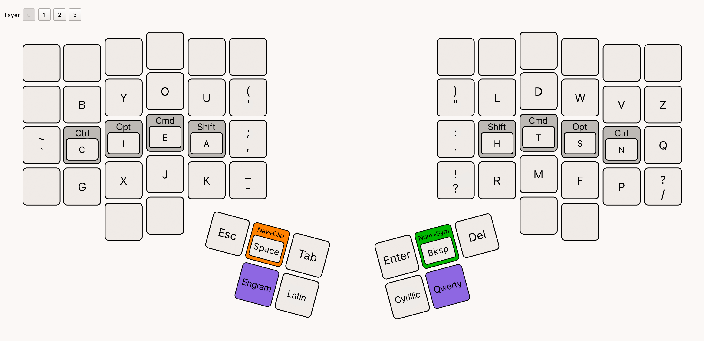
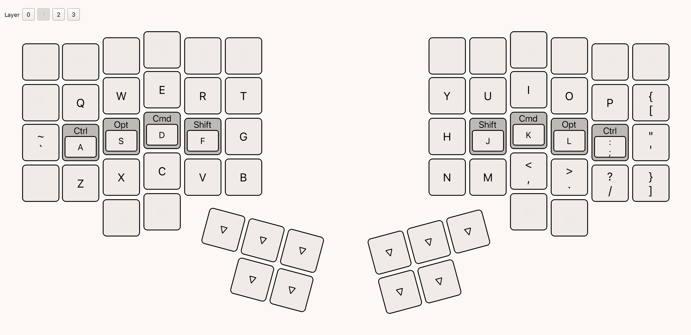
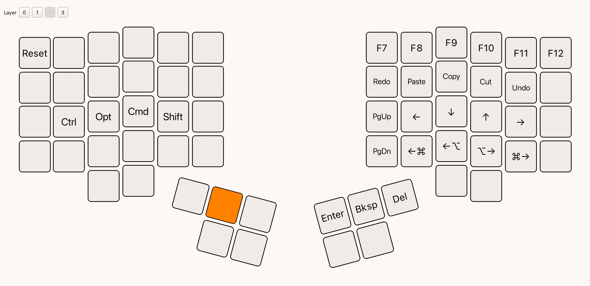
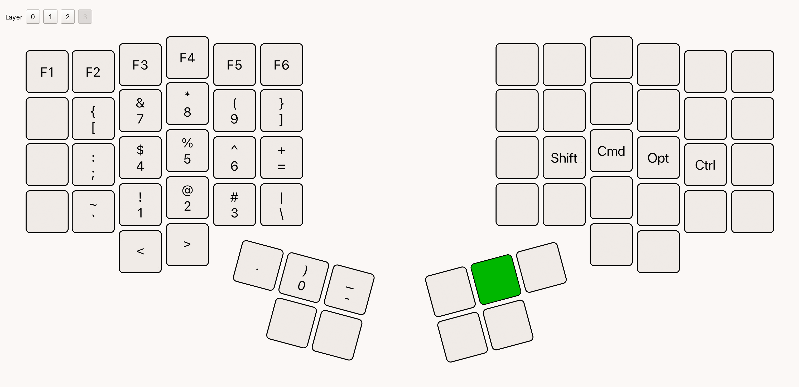

# Layout for Dactyl Manuform 5x6 with 5 thumb keys

An ergonomic keyboard layout inspired by [Miryoku](https://github.com/manna-harbour/miryoku).

## Code

- [Vial layout file](./dm-5x6_5-clbn.vil)

## Layers

### Engram

### Qwerty

### Navigation + Clipboard 

### Numbers + Symbols

