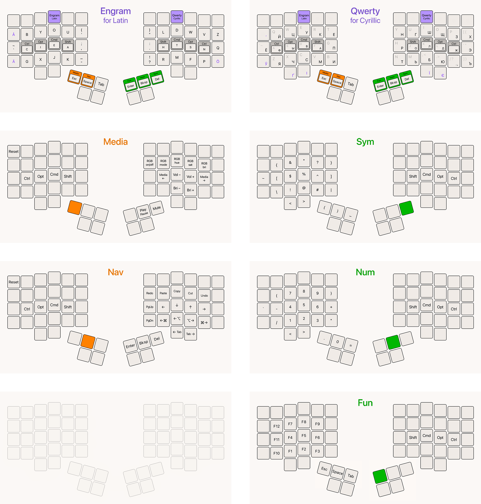

# Charisma

An ergonomic keymap with Engram and Qwerty layouts, made for Dactyl Manuform 5x6, 
inspired by [Miryoku](https://github.com/manna-harbour/miryoku).

## QMK

Full-featured experience shown above, implemented as a QMK keymap:

- [/qmk](./qmk)

## Vial

Lite version with basic features, fits into 4 layers of a Vial layout file:

- [/vial](./vial)
