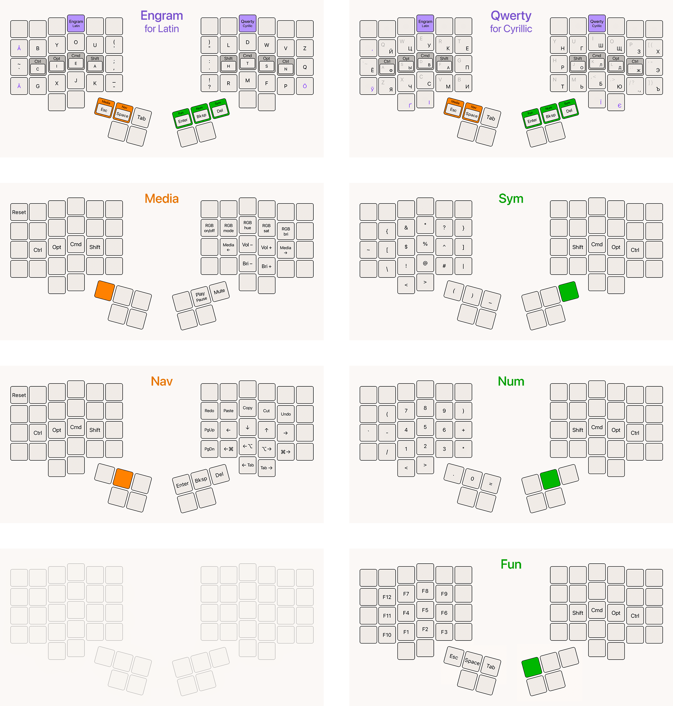

# Charisma

An ergonomic keymap with Engram and Qwerty layouts, made for Dactyl Manuform 5x6, 
inspired by [Miryoku](https://github.com/manna-harbour/miryoku).

## QMK implementation

*TBD*

## Vial version (4 layers)

*TBD*

- [Vial layout file](./vial/charisma.vil)
