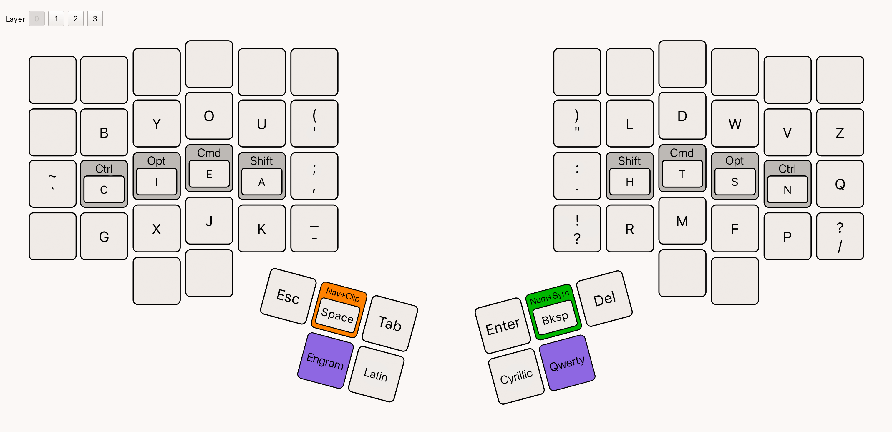
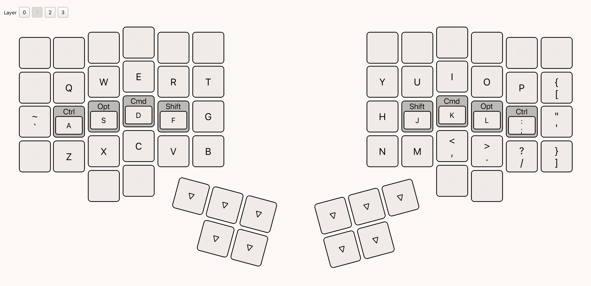
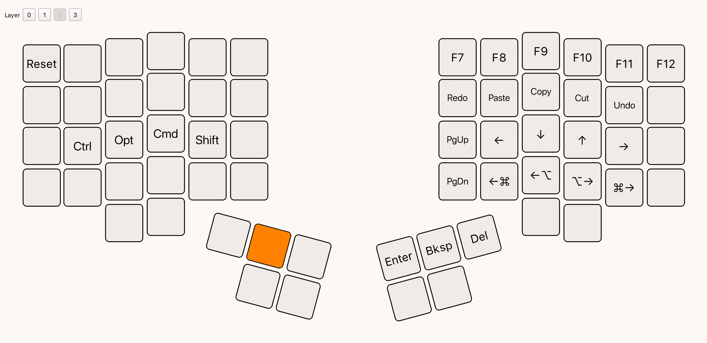
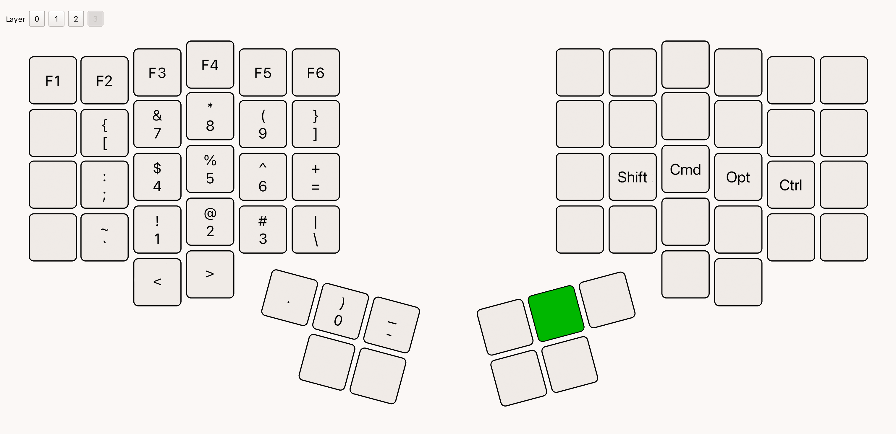

# Charisma for Vial

This is the lite version, it only has basic features that fit into 4 layers of a Vial layout file.

## Code

- [./charisma.vil](./charisma.vil)

## Layers

### Engram

### Qwerty

### Navigation + Clipboard

### Numbers + Symbols

